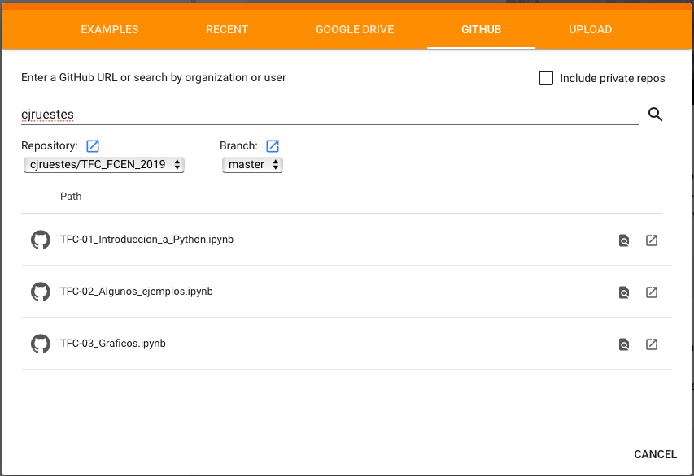
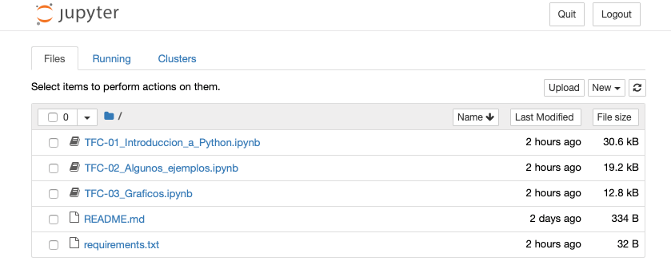
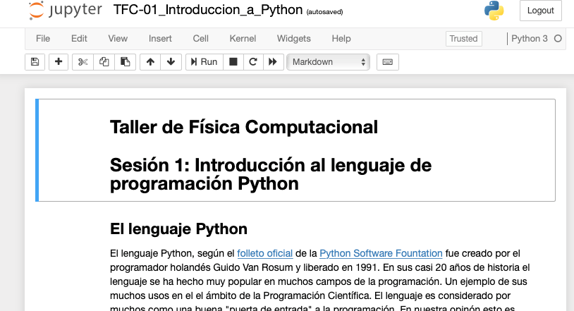
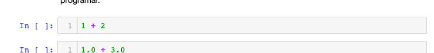
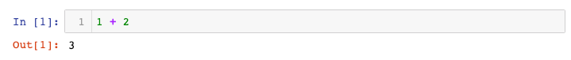

# Instrucciones para abrir los *Notebook*

## En Binder

Abrir el siguiente enlace:

luego de un tiempo se abre una nueva pestaña (o ventana) como la que se muestra [más abajo](#ventana).

## En Google Colab

Si tenés una cuenta de Google puedes abrir el siguiente enlace:

- [Google Colab](https://colab.research.google.com/notebooks/welcome.ipynb)

Abrir un nuevo *notebook* usando el elemento `Open notebook` del menú `File`:

En la ventana que se abre seleccionar la pestaña `GITHUB`, introducir el usuario `cjruestes` y hacer *click* en la lupa. Aparecerá una lista de los *notebook* que están en el repositorio:

Al hacer click en alguno de los nombres se abrirá una ventana similar a la que se muestra [más abajo](#ventana). La principal ventaja de Google Colab es que permite guardar versiones editadas de los notebooks en Google Drive.

## En tu computadora

Descargar una copia del repositorio `git` que se encuentra en el siguiente enlace:

[GitHub - cjruestes/TFC_FCEN_2019: Repositorio público del Taller de Física Computacional - FCEN - UNCUYO](https://github.com/cjruestes/TFC_FCEN_2019)

La descarga puede hacerse usando el botón verde que contiene la leyenda `Clone or Download`. Otra forma es utilizar el comando `git` (que debe estar instalado) de la forma:

`git clone https://github.com/cjruestes/TFC_FCEN_2019.git`

Descargar la versión que corresponda para su sistema operativo de la distribución de python **Anaconda** del siguiente enlace:

[Anaconda Python/R Distribution - Free Download](https://www.anaconda.com/distribution/)

Por favor usar la versión que contiene Python 3.7. En una terminal (Linux o MacOS) o en el Intérprete de Comandos de Windows, una vez en el directorio `TFC_FCEN_2019` ejecutar el comando:

`jupyter notebook`

 Ese comando abre en el navegador configurado por defecto una página como la siguiente:

Al hacer *click* en, por ejemplo, el *notebook* `TFC-01_Introduccion_a_Python.ipynb` se abrirá una nueva pestaña o ventana conteniendo lo siguiente:

Moverse a la primera *celda de código* que aparece de la forma siguiente:

y hacer *click* en la zona gris. La celda se ejecuta presionando las teclas `Shift` y `Enter` o `Mayus` e `Intro` dependiendo del teclado. Esa acción ejecuta el código contenido en la celda produciendo el siguiente resultado:

Puede editarse el contenido de cada celda y ejecutarlo las veces que sean necesarias. La ejecución de las celdas no es necesariamente secuencial. Se debe prestar atención a este punto porque pueden redefinirse variables que son utilizadas en otras celdas.

También pueden editarse las celdas que contienen texto y ecuaciones en formato **markdown**. Pueden encontrar una descripción del formato markdown en el siguiente enlace

- [Markdown Guide](https://www.markdownguide.org)

